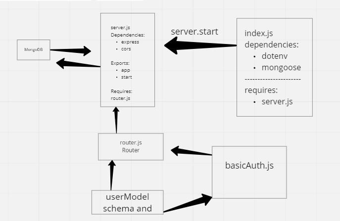

# basic-auth

**lab6:  Deploy an Express server that implements Basic Authentication, with signup and signin capabilities, using a Mongo database for storage.**

### UML

Heroku Link: https://sokiyna-basic-auth.herokuapp.com/
Github Actions: https://github.com/Sokiyna/basic-auth/actions
Pull Request:https: //github.com/Sokiyna/basic-auth/pull/1